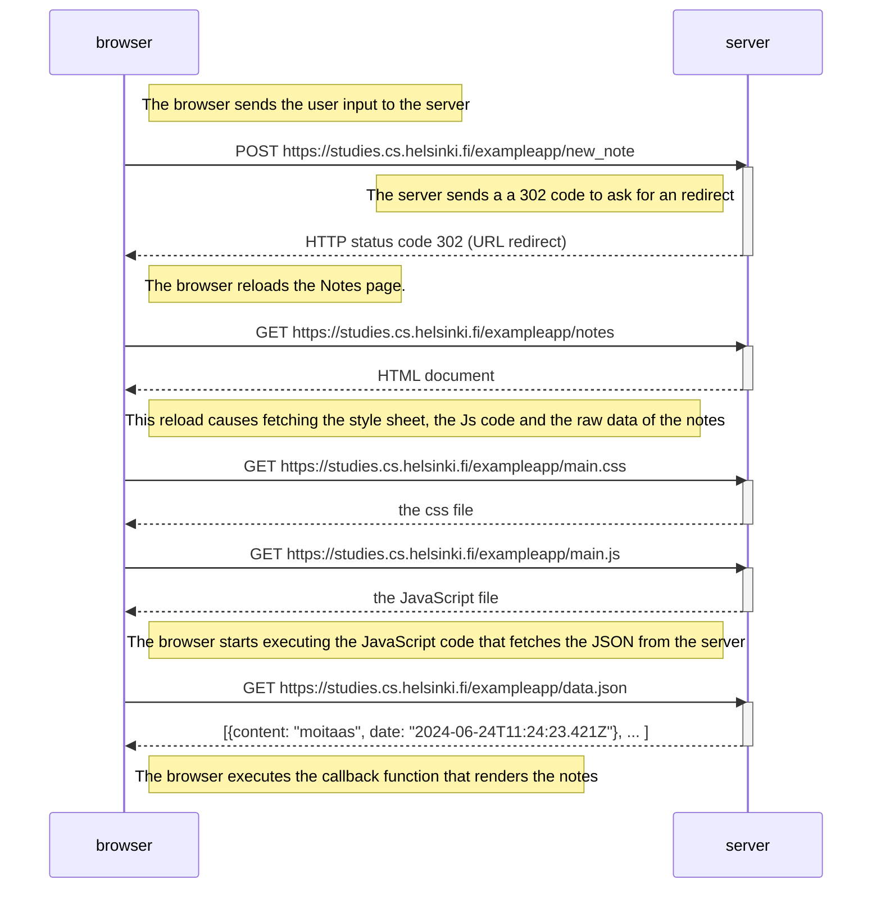

```mermaid
sequenceDiagram
    participant browser
    participant server

    Note right of browser: The browser sends the user input to the server
    browser->>server: POST https://studies.cs.helsinki.fi/exampleapp/new_note
    activate server
    Note left of server: The server sends a a 302 code to ask for an redirect
    server-->>browser: HTTP status code 302 (URL redirect)
    deactivate server

    Note right of browser: The browser reloads the Notes page. 
    browser->>server: GET https://studies.cs.helsinki.fi/exampleapp/notes
    activate server
    server-->>browser: HTML document
    deactivate server

    Note right of browser: This reload causes fetching the style sheet, the Js code and the raw data  of the notes
    browser->>server: GET https://studies.cs.helsinki.fi/exampleapp/main.css
    activate server
    server-->>browser: the css file
    deactivate server

    browser->>server: GET https://studies.cs.helsinki.fi/exampleapp/main.js
    activate server
    server-->>browser: the JavaScript file
    deactivate server

    Note right of browser: The browser starts executing the JavaScript code that fetches the JSON from the server

    browser->>server: GET https://studies.cs.helsinki.fi/exampleapp/data.json
    activate server
    server-->>browser: [{content: "moitaas", date: "2024-06-24T11:24:23.421Z"}, ... ]
    deactivate server

    Note right of browser: The browser executes the callback function that renders the notes
```