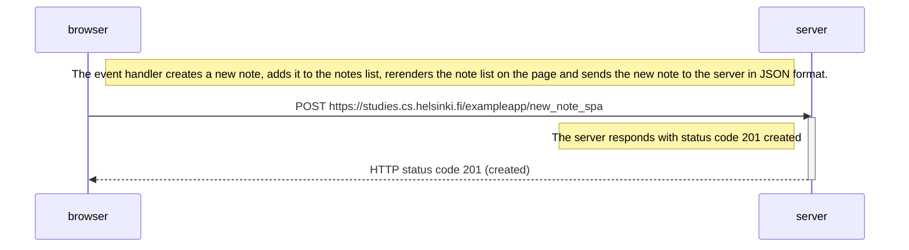

```mermaid
sequenceDiagram
    participant browser
    participant server
    
    Note right of browser: The event handler creates a new note, adds it to the notes list, rerenders the note list on the page and sends the new note to the server in JSON format.
    browser->>server: POST https://studies.cs.helsinki.fi/exampleapp/new_note_spa
    activate server
    Note left of server: The server responds with status code 201 created
    server-->>browser: HTTP status code 201 (created)
    deactivate server
```